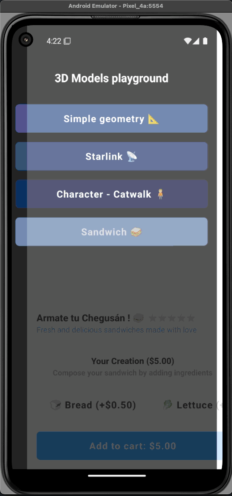
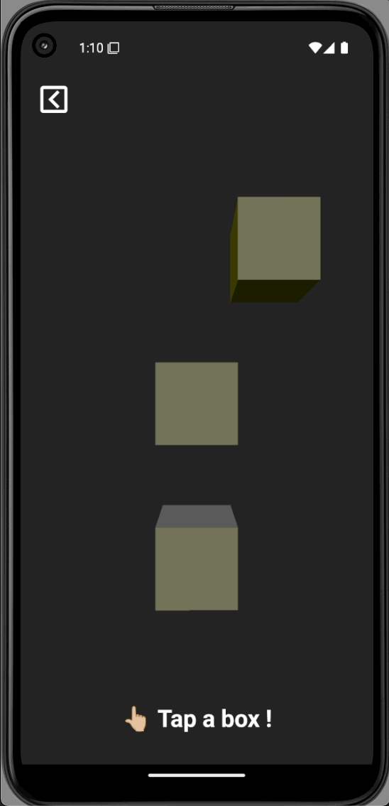
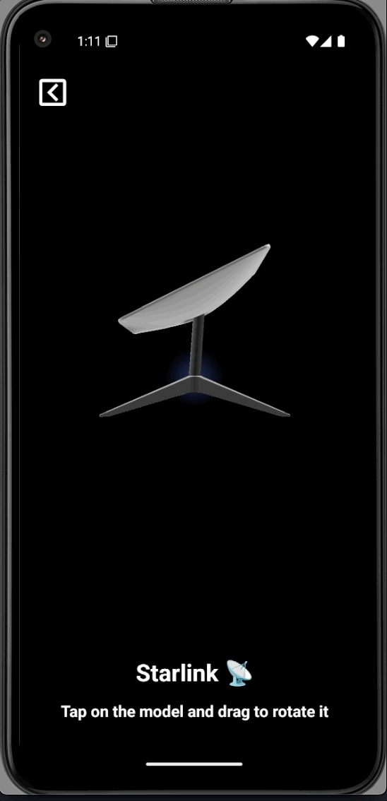

<p align="center">
  
  
</p>
<p align="center">
  
  
</p>

# 3D Playground

## Description

- Playing around with basic 3D stuff 😅

## Additional features:

- React Native with TypeScript for building native mobile applications
- Expo for cross-platform development and easy deployment

- ThreeJS for 3D graphics and animations
- @react-three/drei for useful helpers and abstractions for ThreeJS
- @react-three/fiber for React renderer for ThreeJS
- expo-gl for OpenGL rendering in Expo
- r3f-native-orbitcontrols for touch-based orbit controls in React Native
- three for core 3D graphics library
- three-stdlib for additional ThreeJS utilities and helpers
- @shopify/react-native-skia for high-performance 2D graphics

- nativewind for some basic styling

## Pre-requisites

- Node.js v18 or higher
- Android: Studio and an emulator available for use

## Quick start

```bash
# Install dependencies
npm install

# Do a prebuild for Android
npx expo prebuild

# Run on an Android emulator or device
npm run android
```

### Credits

- Thanks [Rakha Wibowo](https://www.youtube.com/@rakhawibowo) for the wonderful tutorials
  - [Starlink](https://www.youtube.com/watch?v=iRavet_Zau8)
  - [3D character](https://www.youtube.com/watch?v=SP0O5o9BJVA&t=341s)
- Thanks [Wawa Sensei](https://www.youtube.com/@WawaSensei) for the wonderful [animated sandwich tutorial](https://www.youtube.com/watch?v=oCU5j5P20To&t=63s)
