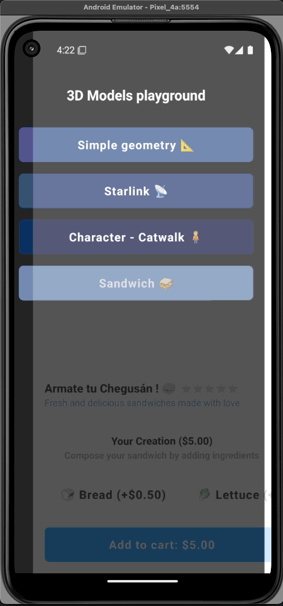
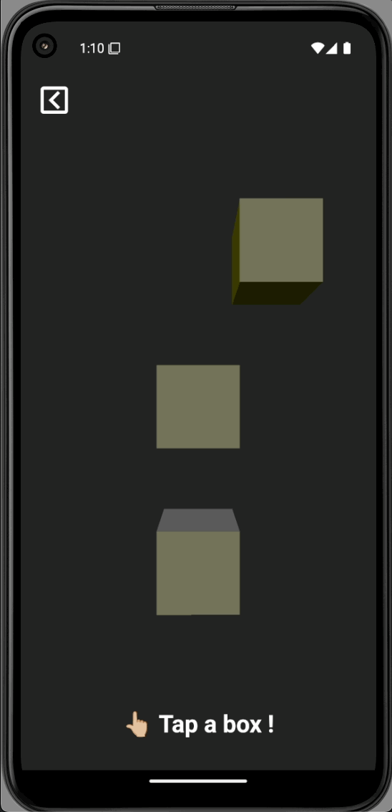
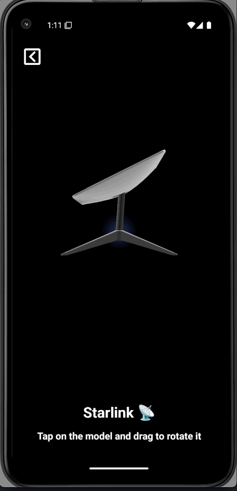

<p align="center">
  
  
</p>
<p align="center">
  
  
</p>

# 3D Playground

> A React Native + Expo 3D sandbox where different interactive scenes are built with Three.js, React Three Fiber, and native orbit controls.

[](https://github.com/AlanCasal/threejs-fiber-things/commits/master)
[](https://github.com/AlanCasal/threejs-fiber-things)

### Core Stack

[](https://www.typescriptlang.org/)
[](https://reactnative.dev/)
[](https://react.dev/)
[](https://expo.dev/)
[](https://docs.expo.dev/router/introduction/)
[](https://www.nativewind.dev/)

### 3D Libraries

[](https://threejs.org/)
[](https://docs.pmnd.rs/react-three-fiber)
[](https://github.com/pmndrs/drei)
[](https://docs.expo.dev/versions/latest/sdk/gl-view/)
[](https://www.npmjs.com/package/r3f-native-orbitcontrols)
[](https://shopify.github.io/react-native-skia/)

## Project Health

[](#project-health)
[](#project-health)

## Why This Project Stands Out

- 🎮 Multiple scene experiments in one app (geometry, starlink, character animation, sandwich builder).
- 📱 Built on React Native + Expo while still rendering rich 3D interactions.
- 🧲 Touch-based orbit controls for intuitive model inspection.
- ✨ Blend of imported GLB assets and procedural mesh experiments.
- 🎨 Simple but effective NativeWind styling for scene wrappers and controls.

## Current Scenes

- 📐 `Simple geometry`: interactive boxes that animate/scale when tapped.
- 📡 `Starlink`: animated GLB model with draggable orbit controls.
- 🧍🏼 `Character - Catwalk`: animated character preview with loading state.
- 🥪 `Sandwich`: ingredient stack with animated transitions and UI controls.

## Architecture Snapshot

- Routing is powered by Expo Router (`src/app`) with:
  - `index` redirecting to `/home`
  - `home` as the scene launcher
  - scene routes under `src/app/(models)/`
- Reusable layout components:
  - `LayoutA` for simple canvas scenes
  - `LayoutOrbitControls` for camera interaction scenes
- 3D scene components live in `src/components/3dModels/*`.
- Shared UI primitives and helpers live under `src/components/common` and `src/hooks`.

## Tech Stack

### Runtime & Framework

- React Native
- Expo SDK 52
- TypeScript
- Expo Router

### 3D & Rendering

- Three.js
- @react-three/fiber
- @react-three/drei
- expo-gl
- r3f-native-orbitcontrols
- three-stdlib
- @react-spring/three

### Styling & State

- NativeWind + Tailwind CSS
- Zustand

## Quick Start

Pre-requisites:

- Node.js 18+
- Android Studio + Android emulator (recommended for this setup)

Install dependencies:

```bash
npm install
```

Run development server:

```bash
npm run start
```

Run targets:

```bash
npm run android
npm run ios
npm run web
```

For first native build or native-module changes:

```bash
npx expo prebuild
```

## Demo Gallery

- 🎥 [Sandwich demo](./assets/demo/sandwich.gif)
- 🎥 [Geometry demo](./assets/demo/geometry.gif)
- 🎥 [Starlink demo](./assets/demo/starlink.gif)
- 🎥 [Character demo](./assets/demo/character.gif)

## Credits

- Thanks [Rakha Wibowo](https://www.youtube.com/@rakhawibowo) for the tutorials that inspired:
  - [Starlink](https://www.youtube.com/watch?v=iRavet_Zau8)
  - [3D character](https://www.youtube.com/watch?v=SP0O5o9BJVA&t=341s)
- Thanks [Wawa Sensei](https://www.youtube.com/@WawaSensei) for the [animated sandwich tutorial](https://www.youtube.com/watch?v=oCU5j5P20To&t=63s).
